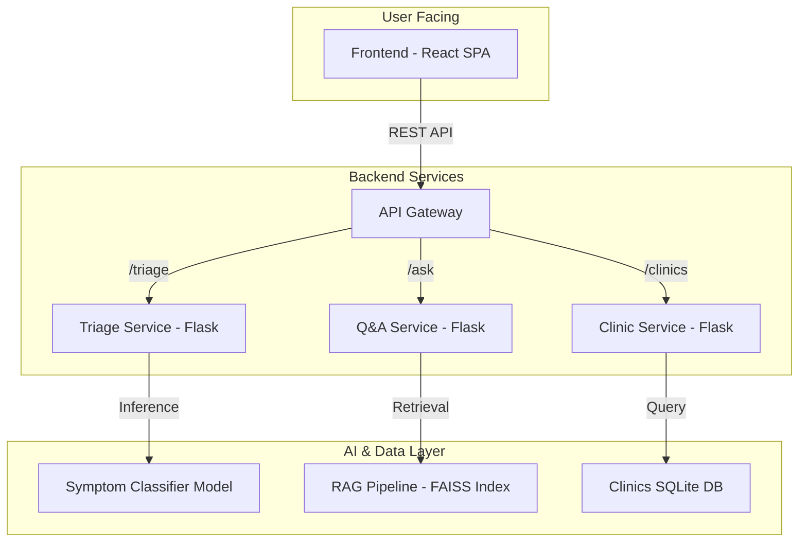

# Swasthya Sahayak: AI-Powered Health Assistance Platform

**Swasthya Sahayak** (Health Assistant) is an intelligent, multi-service platform designed to provide immediate and reliable preliminary health guidance. Built for the Swasthya Hackathon, our mission is to leverage AI to bridge the information gap in healthcare, offering smart symptom triage, a trusted Q&A system, and a local clinic locator.

---

## Table of Contents
- [The Problem & Our Solution](#the-problem--our-solution)
- [Core Features](#core-features)
- [System Architecture](#system-architecture)
- [Technology Stack](#technology-stack)
- [Local Development Setup](#local-development-setup)
- [Project Structure](#project-structure)
- [Future Roadmap](#future-roadmap)
- [Team](#team)

---

## 🎯 The Problem & Our Solution

Access to timely and trustworthy medical information is a critical challenge, often leading to self-misdiagnosis from unreliable online sources. Our platform addresses this by providing users with three integrated services:

- **AI-driven Symptom Triage:** Assess urgency of symptoms.
- **Q&A Service:** Powered by verified medical documents (WHO, Red Cross, etc.).
- **Clinic Locator:** Connects users with nearby healthcare facilities.

---

## ✨ Core Features

- **Smart Symptom Triage:**  
  Classifies user-described symptoms into severity levels (e.g., self-care, doctor visit, emergency) and provides clear, actionable advice.

- **Retrieval-Augmented Q&A:**  
  Answers complex health questions by retrieving information from a curated knowledge base of medical PDFs, ensuring responses are accurate and context-aware.

- **Clinic & Pharmacy Locator:**  
  A map-based interface to find and get directions to nearby registered clinics and pharmacies using a local SQLite database.

---

## 🏗 System Architecture

Our platform utilizes a microservices architecture to ensure scalability and maintainability. Each service operates independently, communicating via a central API gateway.



---

## 💻 Technology Stack

| Area           | Technologies                                                   |
| -------------- | -------------------------------------------------------------- |
| Frontend       | React.js, Tailwind CSS, Mapbox GL JS                          |
| Backend        | Python 3.9+, Flask                                            |
| AI / ML        | Scikit-learn, Hugging Face Transformers, FAISS, PyTorch       |
| Database       | SQLite                                                        |
| DevOps         | Docker, Docker Compose (for containerization)                 |

---

## 🛠 Local Development Setup

### Prerequisites

- Python 3.9+ & pip
- Node.js v16+ & npm
- Git

### 1. Clone the Repository

```bash
git clone https://github.com/PRAVITH10HJ/swasthya-hackathon.git
cd swasthya-hackathon
```

### 2. Prepare AI Models

**Symptom Classifier:**
```bash
cd ai_models/symptom_classifier
# (Optional) Create and activate a virtual environment
pip install -r requirements.txt
python train.py
```

**RAG Pipeline:**  
Add medical PDFs to `/ai_models/rag_pipeline/knowledge_base/` and run:
```bash
cd ai_models/rag_pipeline
# (Optional) Create and activate a virtual environment
pip install -r requirements.txt
python process_docs.py
```

### 3. Set Up Backend Services

For each service (`triage_service`, `qa_service`, `clinic_service`):

```bash
# Open a new terminal for each service
cd backend/<service_name>
python -m venv venv
source venv/bin/activate  # On Windows: venv\Scripts\activate
pip install -r requirements.txt
flask run --port <unique_port_like_5001>
```

### 4. Launch the Frontend

```bash
cd frontend
npm install
npm start
```

The application will be available at [http://localhost:3000](http://localhost:3000).  
Ensure the frontend API calls point to the correct backend service ports.

---

## 📁 Project Structure

```
/swasthya-hackathon
├── backend/                # Microservices
│   ├── triage_service/
│   ├── qa_service/
│   └── clinic_service/
├── ai_models/              # Model training & data processing
│   ├── symptom_classifier/
│   └── rag_pipeline/
├── frontend/               # React Single Page Application
└── README.md
```

---

## 🗺 Future Roadmap

- [ ] **User Authentication:** Implement user accounts to save query history and personal information.
- [ ] **Multi-language Support:** Localize the platform to serve a wider audience in India.
- [ ] **Dockerize Services:** Create `Dockerfile` and `docker-compose.yml` for easy, one-command deployment.
- [ ] **Telemedicine Integration:** Integrate with APIs for booking virtual consultations with doctors.

---

## 👥 Team

- **(Pravith S Upadhyaya)** - Full-Stack & AI - [GitHub Profile](https://github.com/PRAVITH10HJ)
- [Suraksha] - [Frontend]
- [Maruthi prasad reddy] - [Research]
-[Siri shree] - [Research&Presentation]
> This project was developed for the Swasthya Hackathon - September 2025.

---
